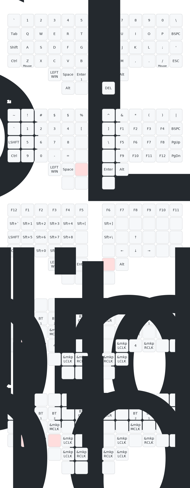

# ZMK-Config for Charybdis

本库专为 **“MiaoMiao”定制版无线 Charybdis** 分体轨迹球键盘提供到手即用的 ZMK 固件方案。支持ZNK Studio 实时改键,优化无线连接与硬件功耗，固件兼容官方焊接版本。

---

## 🗺️ 键位布局

*每次提交 `.keymap` 文件，本图均由 GitHub Actions 自动生成并更新。*

---

## 🛠️ 图形化改键

### 1. ZMK Studio (实时动态配置)
通过 ZMK 官方协议直接对键盘进行免刷机实时改键，更改即刻生效。
- **如何使用**：使用受支持的 Chromium 内核浏览器（如 Chrome / Edge），打开并连接 [ZMK Studio](https://zmk.studio/)，亦可使用其桌面客户端。
- **核心优势**：**即时通讯**。通过 Web Serial (USB) 或 Web Bluetooth 直接与硬件交互，无需等待 GitHub Actions 编译及手动烧录，最适合日常快速微调基础键位。

### 2. Keymap Editor (云端全域编译)
社区最成熟的可视化网页编辑器，深度集成 GitHub 工作流，适合对键盘布局进行全方位的架构大修。
- **如何使用**：Fork 本仓库后，在 GitHub Actions 页面进行首次固件编译。随后访问 [Keymap Editor](https://nickcoutsos.github.io/keymap-editor/)，授权登录并选择你的 `zmk-for-charybdis` 仓库。
- **核心优势**：**全能编辑**。在直观的图形界面中拖拽修改键位，完美支持 Combos（组合键）、Macros（宏）以及各类复杂行为（Behaviors）的深度编辑。保存后自动向 GitHub 提交代码并触发云端编译。

---

## 🚀 固件烧录指南

> **📌 烧录须知：**
> - **需要烧录**：仅当通过 **Keymap Editor** 修改布局、直接编辑 **库内代码**、或**首次初始化**键盘时，才需要执行以下烧录流程。
> - **无需烧录**：若仅使用 **ZMK Studio** 进行实时键位微调，更改已即时写入硬件，请直接忽略本指南。

### 烧录标准化流程：

1. **固件编译**：在网页端修改配置后，GitHub Actions 会自动触发编译。请前往当前仓库的 **Actions** 页面获取最新的构建产物。
2. **下载固件**：编译完成后，在构建任务的 📦 Artifacts 列表中下载 `firmware.zip` 压缩包。
3. **解压文件**：解压该压缩包，获得对应左手和右手的 `left.uf2` 与 `right.uf2` 固件文件。
4. **触发模式**：使用 USB 数据线将键盘连接至电脑，连续按下两次复位按键（Reset），使主控进入 Bootloader 模式（此时电脑会识别出虚拟 U 盘）。
5. **拖入升级**：将对应的 `.uf2` 文件分别拖入左右手主控对应的虚拟 U 盘中，设备会自动重启并完成固件烧录。

> **⚠️ 注意：** 左右手主控固件相互独立，两端均需要分别连接电脑进行烧录。

---

## 📝 鸣谢与支持

*   **文档说明**：本说明文档基于 AI 辅助生成，作者已针对核心技术细节与操作流程进行了人工二次审核与深度编辑。对于自动化文本中可能存在的个别措辞瑕疵或语法滞涩，在此深表歉意。
*   **技术支持**：若您是使用 **“MIAOMIAO”** 制作的 Charybdis 分体键盘用户，在固件使用、图形化改键或固件烧录过程中遇到任何疑问，欢迎随时通过以下渠道联系作者：
    *   **📩 Gmail**：`heetuic@gmail.com`
    *   **🐟 闲鱼**：搜索用户 **“喵喵喵猫”**
